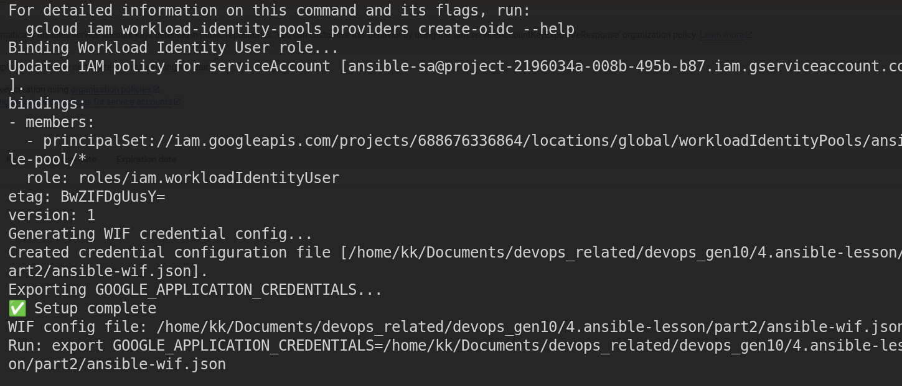

## ⚠️ Important update 
before we are able to easily use the key from serviceaccount 
`serviceaccount.json`

using OIDC instead as a short-lived token 

```bash

#1. Crate service accont (no Key ) 
gcloud am service-accounts create ansible-sa \
    --project YOUR-PROJECT-ID

# 2.Grant permission 
gcloud projects add-iam-policy-binding YOUR-PROJECT-ID \
    --member="serviceaccount:ansible-sa@YOURPOJECT-ID.iam.gserviceaccount.com \
    --role="roles/compute.admin"
# 3. Create identity provider 
gcloud iam workload-identity-pools providers create-oidc ansible-provider \
    --location=global \
    --workload-identity-pool=ansible-pool \
    --issuer-url="https://accounts.google.com" 

# git github/gitlab/clustum IdP, issuer differs. 


# Allow pool to impersonate the Service Account 
gcloud iam service-accounts add-iam-policy-binding \
    ansible-sa@YOUR-PROJECT-ID.iam.gserviceaccount.com \
    --role="roles/iam.workloadIdentityUser" \
    --member="principleSet://iam.googleapis.com/projects/PROJECT_NUMBER/locations/global/workloadIdentityPools/ansible-pool/*"


#5. Create a credential config (This replace the JSON key )
gcloud iam workload-identity-pools create-cred-config \
    projects/PROJECT_NUMBER/locations/global/workloadIdentityPools/ansible-pool/providers/ansible-provider \
  --service-account=ansible-sa@YOUR_PROJECT_ID.iam.gserviceaccount.com \
  --output-file=ansible-wif.json


#6. Export environment Variable 
export  GOOGLE_APPLICATION_CREDENTIALS=$PWD/ansible-wif.json 

```
- Some common commands 
```bash
# install gcloud cli 
sudo apt-get update
sudo apt-get install apt-transport-https ca-certificates gnupg curl
sudo apt-get update && sudo apt-get install google-cloud-cli


gcloud auth login 
gcloudauth application-default login 

gcloud auth list 
gcloud config list 
gcloud projects list 
glcoud compute zones list

gcloud auth revoke --all
gcloud auth application-default revoke
```


***
```bash
Ansible
  → credential config file (NON-secret)
  → short-lived token (auto-generated)
  → service account (impersonation)
  → GCP

```

```bash
export GOOGLE_APPLICATION_CREDENTIALS=/home/kk/Documents/devops_related/devops_gen10/4.ansible-lesson/part2/ansible-wif.json
export GOOGLE_EXTERNAL_ACCOUNT_ALLOW_EXECUTABLES=1


export GOOGLE_APPLICATION_CREDENTIALS=/home/kk/.config/gcloud/application_default_credentials.json


gcloud auth application-default login --client-id-file=/home/kk/Documents/devops_related/devops_gen10/4.ansible-lesson/part2/ansible-wif.json


#this work 
gcloudauth application-default login 
```
> WIF not actually work on free-trails 