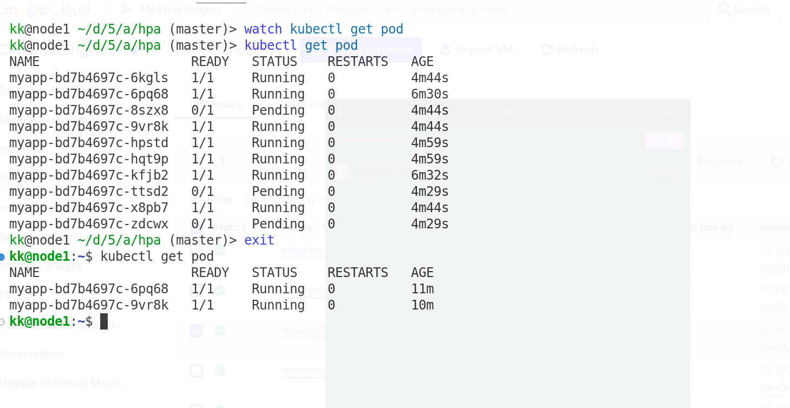

## NOTE related dto Horizontal Pod Autoscaller 

- Scale Pod to support traffic spike ( when there are too many request )

- tool to load test ( ab ) : apache benchmark
- svc -> deployment 
- hpa 


```bash 
ab -n 5000 -c 100  http://10.233.21.83/ 

```

